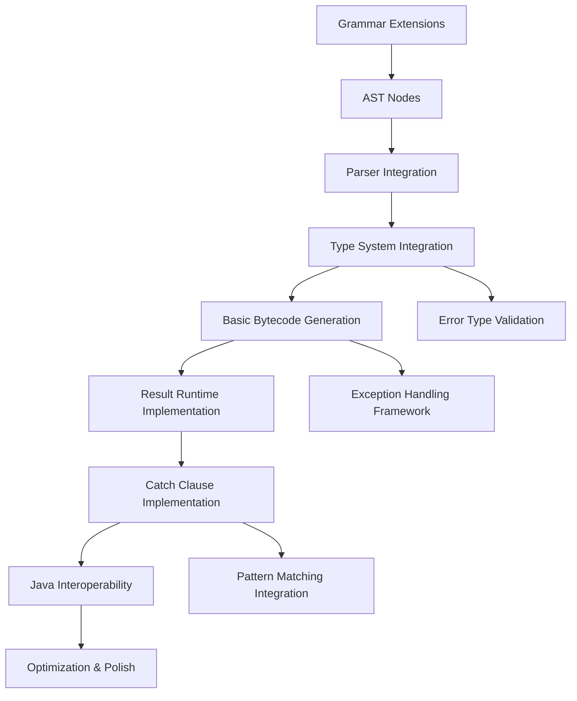

# Try Syntax Implementation - Technical Design Document

**Document Version**: 1.0  
**Created**: 2025-08-12  
**Author**: Tech Lead  
**Status**: Design Phase  

## Executive Summary

This document provides a comprehensive technical design for implementing try syntax in TaylorLang, a functional programming language that compiles to JVM bytecode. The implementation will enable functional error handling using `Result<T, E: Throwable>` types with try expressions that integrate seamlessly with the JVM's exception handling infrastructure.

**Key Design Decisions**:
- Result<T, E: Throwable> - Error type constrained to Throwable subtypes
- Try expressions only usable in functions returning Result types
- Leverage JVM exception handling for stacktrace management
- Use Throwable.addSuppressed() for try expression location chaining

## 1. Background and Context

### 1.1 Current State

TaylorLang is a functional programming language with:
- **Pattern Matching**: 96% implementation success rate, production-ready
- **Type System**: Constraint-based inference with union type support
- **JVM Compilation**: Mature bytecode generation pipeline
- **Result Types**: Documented in specification but not implemented

### 1.2 Industry Research - JVM Error Handling Patterns

**Kotlin (2025 State)**:
- Result<T> type since version 1.3
- runCatching() for wrapping computations
- Arrow library provides Either monad
- Limitation: Doesn't distinguish fatal from recoverable exceptions

**Scala Approach**:
- Try<T> with Success/Failure variants
- Preserves exception information for debugging
- Strong pattern matching integration
- Mature ecosystem adoption

**Functional Programming Best Practices**:
- Monadic composition with flatMap/map operations
- Explicit error propagation vs. exception throwing
- Type-safe error handling with compile-time guarantees

### 1.3 TaylorLang Language Philosophy

TaylorLang emphasizes:
- **Immutability by default**
- **Hindley-Milner type inference**
- **Seamless Java interoperability**
- **Pure functional programming with practical pragmatism**

## 2. Requirements Analysis

### 2.1 Functional Requirements

**FR1: Try Expression Syntax**
```kotlin
// Basic try syntax - unwrap Result or propagate error
val user = try database.findUser(id)

// Try with explicit error handling
val result = try {
    val user = try database.findUser(id)
    val profile = try user.getProfile()
    profile.format()
} catch {
    case DatabaseError(msg) => handleDatabaseError(msg)
    case ProfileError(msg) => handleProfileError(msg)
}
```

**FR2: Result Type Integration**
```kotlin
// Functions returning Result can use try
fn processUser(id: String): Result<String, DatabaseError> => {
    val user = try database.findUser(id)  // database.findUser returns Result
    Ok(user.name)
}

// Compile error - function doesn't return Result
fn processUser(id: String): String => {
    val user = try database.findUser(id)  // ERROR: No Result in return type
    user.name
}
```

**FR3: Error Type Constraints**
```kotlin
// Error types must extend Throwable
type DatabaseError: Throwable = 
  | ConnectionFailed(message: String)
  | UserNotFound(id: String)
  | ValidationError(field: String, reason: String)

// Result type with Throwable constraint
fn findUser(id: String): Result<User, DatabaseError> => {
    // Implementation
}
```

**FR4: Automatic Error Propagation**
```kotlin
fn processUserChain(id: String): Result<ProcessedUser, AppError> => {
    val user = try findUser(id)           // propagates DatabaseError -> AppError
    val profile = try user.getProfile()   // propagates ProfileError -> AppError  
    val processed = try processProfile(profile) // propagates ProcessingError -> AppError
    Ok(processed)
}
```

### 2.2 Non-Functional Requirements

**NFR1: Performance**
- Try expressions should have minimal runtime overhead
- Leverage JVM's optimized exception handling mechanisms
- No performance degradation compared to manual Result handling

**NFR2: Java Interoperability**
- Seamless integration with Java exception-throwing code
- Automatic conversion of Java exceptions to Result types
- Preserve original stacktrace information

**NFR3: Type Safety**
- Compile-time enforcement of Result return types for try usage
- Type inference for try expressions
- Exhaustive error handling verification

**NFR4: Developer Experience**
- Clear error messages for incorrect try usage
- Helpful IDE support and tooling
- Familiar syntax for developers from other functional languages

## 3. Technical Architecture

### 3.1 Overall Architecture

```
┌─────────────────┐    ┌─────────────────┐    ┌─────────────────┐
│   Grammar       │───▶│   AST Nodes     │───▶│  Type Checker   │
│   Extensions    │    │                 │    │                 │
│  - try expr     │    │ - TryExpression │    │ - Result type   │
│  - catch blocks │    │ - CatchClause   │    │   validation    │
└─────────────────┘    └─────────────────┘    └─────────────────┘
                                │                        │
                                ▼                        ▼
┌─────────────────┐    ┌─────────────────┐    ┌─────────────────┐
│   Runtime       │◀───│   Bytecode      │◀───│   Semantic      │
│   Support       │    │   Generation    │    │   Analysis      │
│                 │    │                 │    │                 │
│ - Exception     │    │ - Exception     │    │ - Error type    │
│   handling      │    │   handling      │    │   inference     │
│ - Result utils  │    │ - Try/catch     │    │ - Constraint    │
└─────────────────┘    └─────────────────┘    └─────────────────┘
```

### 3.2 Component Interaction

**Phase 1: Parsing**
1. Grammar recognizes try expressions and catch blocks
2. ASTBuilder creates TryExpression and CatchClause nodes
3. Parser validates basic syntax structure

**Phase 2: Type Checking**
1. Validate function return type is Result<T, E>
2. Infer types for try expressions
3. Check error type compatibility and constraints
4. Ensure exhaustive error handling in catch blocks

**Phase 3: Bytecode Generation**
1. Generate JVM exception handling bytecode
2. Implement Result type construction/deconstruction
3. Handle automatic error propagation
4. Integrate with existing pattern matching framework

**Phase 4: Runtime**
1. Provide Result type utilities
2. Exception to Result conversion
3. Stacktrace preservation and enhancement

## 4. Detailed Design

### 4.1 Grammar Extensions

**Current Grammar State**: TaylorLang uses ANTLR4 grammar with comprehensive expression support.

**Required Extensions**:

```antlr
// Add to expression alternatives
expression
    : // ... existing alternatives
    | tryExpr                             // Try expression
    ;

// Try expression syntax
tryExpr
    : 'try' expression                    // Simple try - propagate on error
    | 'try' blockExpr ('catch' catchBlock)? // Try with optional catch
    ;

// Catch block for error handling
catchBlock: '{' matchCase+ '}';

// Match case for error patterns (reuse existing pattern matching)
matchCase: 'case' pattern ('=>' | '→') expression;
```

**Integration Points**:
- Reuse existing pattern matching infrastructure for catch blocks
- Leverage current expression parsing for try targets
- Maintain consistency with existing block expression syntax

**Grammar Validation**:
- Try expressions must be valid expressions
- Catch blocks must follow pattern matching syntax
- Nested try expressions supported

### 4.2 AST Node Modifications

**New AST Nodes**:

```kotlin
// Try expression with optional catch handling
data class TryExpression(
    val expression: Expression,
    val catchClauses: PersistentList<CatchClause> = persistentListOf(),
    override val sourceLocation: SourceLocation? = null
) : Expression {
    override fun <R> accept(visitor: ASTVisitor<R>): R = visitor.visitTryExpression(this)
}

// Catch clause for error handling
data class CatchClause(
    val pattern: Pattern,
    val guardExpression: Expression? = null,
    val body: Expression,
    override val sourceLocation: SourceLocation? = null
) : ASTNode {
    override fun <R> accept(visitor: ASTVisitor<R>): R = visitor.visitCatchClause(this)
}
```

**Visitor Pattern Integration**:

```kotlin
interface ASTVisitor<R> {
    // ... existing methods
    fun visitTryExpression(node: TryExpression): R
    fun visitCatchClause(node: CatchClause): R
}

class BaseASTVisitor<R> : ASTVisitor<R> {
    // ... existing implementations
    
    override fun visitTryExpression(node: TryExpression): R {
        visitExpression(node.expression)
        node.catchClauses.forEach { visitCatchClause(it) }
        return defaultResult()
    }
    
    override fun visitCatchClause(node: CatchClause): R {
        visitPattern(node.pattern)
        node.guardExpression?.let { visitExpression(it) }
        visitExpression(node.body)
        return defaultResult()
    }
}
```

**AST Builder Integration**:

```kotlin
class ASTBuilder : TaylorLangBaseVisitor<ASTNode>() {
    // ... existing methods
    
    override fun visitTryExpr(ctx: TaylorLangParser.TryExprContext): TryExpression {
        val expression = visitExpression(ctx.expression()) as Expression
        val catchClauses = ctx.catchBlock()?.let { catchBlock ->
            catchBlock.matchCase().map { visitCatchClause(it) as CatchClause }
        } ?: persistentListOf()
        
        return TryExpression(
            expression = expression,
            catchClauses = catchClauses.toPersistentList(),
            sourceLocation = getSourceLocation(ctx)
        )
    }
}
```

### 4.3 Type System Integration

**Result Type Definition**:

```kotlin
// Built-in Result type with Throwable constraint
data class ResultType(
    val successType: Type,
    val errorType: Type,
    override val sourceLocation: SourceLocation? = null
) : Type {
    override fun structurallyEquals(other: Type): Boolean {
        return other is ResultType && 
               successType.structurallyEquals(other.successType) &&
               errorType.structurallyEquals(other.errorType)
    }
}

// Type validation for Result constraint
object ResultTypeValidator {
    fun validateErrorType(errorType: Type): ValidationResult {
        return when {
            isThrowableSubtype(errorType) -> ValidationResult.Success
            else -> ValidationResult.Error("Error type must extend Throwable")
        }
    }
    
    private fun isThrowableSubtype(type: Type): Boolean {
        // Check if type extends java.lang.Throwable
        return when (type) {
            is Type.Named -> isThrowableClass(type.name)
            is Type.Union -> type.variants.all { isThrowableSubtype(it) }
            else -> false
        }
    }
}
```

**Type Checking Rules**:

1. **Function Return Type Validation**:
```kotlin
class TryExpressionTypeChecker {
    fun checkTryExpression(
        tryExpr: TryExpression, 
        context: TypeContext
    ): TypeCheckResult {
        // Validate function returns Result type
        val functionReturnType = context.getCurrentFunctionReturnType()
        if (!isResultType(functionReturnType)) {
            return TypeCheckResult.Error(
                "Try expressions can only be used in functions returning Result types",
                tryExpr.sourceLocation
            )
        }
        
        // Type check the try expression
        val exprResult = typeCheckExpression(tryExpr.expression, context)
        if (!isResultType(exprResult.type)) {
            return TypeCheckResult.Error(
                "Try expression must evaluate to a Result type",
                tryExpr.expression.sourceLocation
            )
        }
        
        // Extract success type from Result for variable binding
        val successType = extractSuccessType(exprResult.type)
        return TypeCheckResult.Success(successType)
    }
}
```

2. **Error Type Unification**:
```kotlin
class ErrorTypeUnifier {
    fun unifyErrorTypes(
        targetErrorType: Type,
        sourceErrorType: Type
    ): UnificationResult {
        // Error types must be compatible (subtype relationship)
        return when {
            areErrorTypesCompatible(targetErrorType, sourceErrorType) -> 
                UnificationResult.Success(targetErrorType)
            else -> 
                UnificationResult.Error("Incompatible error types")
        }
    }
    
    private fun areErrorTypesCompatible(target: Type, source: Type): Boolean {
        // Source error type must be assignable to target error type
        return isSubtypeOf(source, target) || 
               canBeAutoConverted(source, target)
    }
}
```

3. **Catch Block Type Checking**:
```kotlin
class CatchClauseTypeChecker {
    fun checkCatchClauses(
        clauses: List<CatchClause>,
        errorType: Type,
        returnType: Type,
        context: TypeContext
    ): TypeCheckResult {
        // Check pattern matching exhaustiveness
        val exhaustivenessResult = checkExhaustiveness(clauses, errorType)
        if (!exhaustivenessResult.isExhaustive) {
            return TypeCheckResult.Warning(
                "Non-exhaustive pattern matching in catch clauses",
                clauses.firstOrNull()?.sourceLocation
            )
        }
        
        // Check each clause body type
        for (clause in clauses) {
            val bodyType = typeCheckExpression(clause.body, context)
            if (!isCompatibleType(bodyType.type, returnType)) {
                return TypeCheckResult.Error(
                    "Catch clause body type incompatible with function return type",
                    clause.body.sourceLocation
                )
            }
        }
        
        return TypeCheckResult.Success(returnType)
    }
}
```

### 4.4 Bytecode Generation Strategy

**Exception Handling Approach**:

TaylorLang will use a hybrid approach combining functional Result types with JVM exception handling:

1. **Result Type Runtime Representation**:
```kotlin
// JVM representation of Result<T, E>
sealed class TaylorResult<T, E> where E : Throwable {
    data class Ok<T, E>(val value: T) : TaylorResult<T, E>() where E : Throwable
    data class Error<T, E>(val error: E) : TaylorResult<T, E>() where E : Throwable
    
    // Utility methods for JVM integration
    fun getOrThrow(): T = when (this) {
        is Ok -> value
        is Error -> throw error
    }
    
    fun isOk(): Boolean = this is Ok
    fun isError(): Boolean = this is Error
}
```

2. **Try Expression Bytecode Generation**:
```kotlin
class TryExpressionBytecodeGenerator {
    fun generateTryExpression(
        tryExpr: TryExpression,
        methodVisitor: MethodVisitor,
        context: BytecodeGenerationContext
    ) {
        val tryLabel = Label()
        val catchLabel = Label()
        val endLabel = Label()
        
        // Generate try block
        methodVisitor.visitLabel(tryLabel)
        generateExpression(tryExpr.expression, methodVisitor, context)
        
        // Check if Result is Ok - if yes, extract value and continue
        // If Error, either handle with catch clauses or propagate
        methodVisitor.visitInsn(DUP) // Duplicate Result on stack
        methodVisitor.visitMethodInsn(
            INVOKEVIRTUAL,
            "org/taylorlang/runtime/TaylorResult",
            "isOk",
            "()Z",
            false
        )
        methodVisitor.visitJumpInsn(IFEQ, catchLabel) // Jump to catch if Error
        
        // Extract value from Ok case
        methodVisitor.visitMethodInsn(
            INVOKEVIRTUAL,
            "org/taylorlang/runtime/TaylorResult\$Ok",
            "getValue",
            "()Ljava/lang/Object;",
            false
        )
        methodVisitor.visitJumpInsn(GOTO, endLabel)
        
        // Handle Error case
        methodVisitor.visitLabel(catchLabel)
        if (tryExpr.catchClauses.isNotEmpty()) {
            generateCatchClauses(tryExpr.catchClauses, methodVisitor, context)
        } else {
            // No catch clauses - propagate error by returning it
            // Result is already on stack, just return it
        }
        
        methodVisitor.visitLabel(endLabel)
    }
    
    private fun generateCatchClauses(
        clauses: List<CatchClause>,
        methodVisitor: MethodVisitor,
        context: BytecodeGenerationContext
    ) {
        // Extract error from Result.Error
        methodVisitor.visitMethodInsn(
            INVOKEVIRTUAL,
            "org/taylorlang/runtime/TaylorResult\$Error",
            "getError",
            "()Ljava/lang/Throwable;",
            false
        )
        
        // Generate pattern matching for catch clauses
        // Reuse existing pattern matching bytecode generation
        for (clause in clauses) {
            val patternCompiler = PatternBytecodeCompiler(methodVisitor, context)
            patternCompiler.generatePatternMatch(
                clause.pattern,
                clause.body,
                // ... pattern matching parameters
            )
        }
    }
}
```

3. **Integration with JVM Exception Handling**:
```kotlin
class ExceptionToResultConverter {
    companion object {
        @JvmStatic
        fun wrapJavaCall(block: () -> Any?): TaylorResult<Any?, Throwable> {
            return try {
                TaylorResult.Ok(block())
            } catch (e: Throwable) {
                TaylorResult.Error(e)
            }
        }
        
        @JvmStatic
        fun <T, E> propagateError(
            result: TaylorResult<T, E>,
            location: String
        ): TaylorResult<T, E> where E : Throwable {
            return when (result) {
                is TaylorResult.Ok -> result
                is TaylorResult.Error -> {
                    // Add suppressed exception for try location tracking
                    val locationException = RuntimeException("Try expression at $location")
                    result.error.addSuppressed(locationException)
                    result
                }
            }
        }
    }
}
```

### 4.5 Runtime Support Requirements

**Core Runtime Components**:

1. **Result Type Implementation**:
```kotlin
// Runtime implementation in org.taylorlang.runtime package
package org.taylorlang.runtime

sealed class TaylorResult<out T, out E> where E : Throwable {
    data class Ok<T>(val value: T) : TaylorResult<T, Nothing>()
    data class Error<E : Throwable>(val error: E) : TaylorResult<Nothing, E>()
    
    // Monadic operations
    inline fun <R> map(transform: (T) -> R): TaylorResult<R, E> = when (this) {
        is Ok -> Ok(transform(value))
        is Error -> this
    }
    
    inline fun <R> flatMap(transform: (T) -> TaylorResult<R, E>): TaylorResult<R, E> = when (this) {
        is Ok -> transform(value)
        is Error -> this
    }
    
    inline fun <R> mapError(transform: (E) -> R): TaylorResult<T, R> where R : Throwable = when (this) {
        is Ok -> this
        is Error -> Error(transform(error))
    }
    
    // Java interop methods
    fun getOrThrow(): T = when (this) {
        is Ok -> value
        is Error -> throw error
    }
    
    fun getOrNull(): T? = when (this) {
        is Ok -> value
        is Error -> null
    }
    
    fun getOrDefault(default: T): T = when (this) {
        is Ok -> value
        is Error -> default
    }
}
```

2. **Java Interoperability Utilities**:
```kotlin
object JavaInterop {
    // Convert Java throwing methods to Result
    inline fun <T> catching(block: () -> T): TaylorResult<T, Throwable> {
        return try {
            TaylorResult.Ok(block())
        } catch (e: Throwable) {
            TaylorResult.Error(e)
        }
    }
    
    // Convert specific exception types
    inline fun <T, E : Throwable> catching(
        exceptionClass: Class<E>,
        block: () -> T
    ): TaylorResult<T, E> {
        return try {
            TaylorResult.Ok(block())
        } catch (e: Throwable) {
            if (exceptionClass.isInstance(e)) {
                @Suppress("UNCHECKED_CAST")
                TaylorResult.Error(e as E)
            } else {
                throw e // Re-throw unexpected exceptions
            }
        }
    }
}
```

3. **Stacktrace Enhancement**:
```kotlin
class TryLocationTracker {
    companion object {
        private val tryLocationStack = ThreadLocal<MutableList<String>>()
        
        fun enterTryExpression(location: String) {
            val stack = tryLocationStack.get() ?: mutableListOf()
            stack.add(location)
            tryLocationStack.set(stack)
        }
        
        fun exitTryExpression() {
            val stack = tryLocationStack.get()
            if (stack != null && stack.isNotEmpty()) {
                stack.removeLastOrNull()
                if (stack.isEmpty()) {
                    tryLocationStack.remove()
                }
            }
        }
        
        fun enhanceStacktrace(error: Throwable) {
            val stack = tryLocationStack.get()
            if (stack != null) {
                for (location in stack.reversed()) {
                    val tryException = RuntimeException("Try expression at $location")
                    error.addSuppressed(tryException)
                }
            }
        }
    }
}
```

### 4.6 Java Interoperability Design

**Automatic Exception Wrapping**:

```kotlin
// TaylorLang code
import java.io.File

fn readFileContents(path: String): Result<String, IOException> => {
    val file = File(path)
    val contents = try JavaInterop.catching(IOException.class) { 
        file.readText() 
    }
    contents
}

// Generated bytecode equivalent:
public static TaylorResult<String, IOException> readFileContents(String path) {
    File file = new File(path);
    return JavaInterop.catching(IOException.class, () -> {
        return file.readText();
    });
}
```

**Result Type Conversions**:

```kotlin
// Automatic conversions between TaylorLang Result and Java Optional/CompletableFuture
object ResultConversions {
    fun <T> resultToOptional(result: TaylorResult<T, *>): Optional<T> = when (result) {
        is TaylorResult.Ok -> Optional.of(result.value)
        is TaylorResult.Error -> Optional.empty()
    }
    
    fun <T> optionalToResult(optional: Optional<T>): TaylorResult<T, NoSuchElementException> {
        return if (optional.isPresent) {
            TaylorResult.Ok(optional.get())
        } else {
            TaylorResult.Error(NoSuchElementException("Optional was empty"))
        }
    }
    
    fun <T> futureToResult(future: CompletableFuture<T>): TaylorResult<T, Throwable> {
        return try {
            TaylorResult.Ok(future.get())
        } catch (e: ExecutionException) {
            TaylorResult.Error(e.cause ?: e)
        } catch (e: Throwable) {
            TaylorResult.Error(e)
        }
    }
}
```

## 5. Implementation Plan

### 5.1 Phase Breakdown

**Phase 1: Foundation (Week 1)**
- Grammar extensions for try expressions
- AST node definitions and visitor integration
- Basic parsing support
- **Deliverable**: Try expressions parse correctly without semantic analysis

**Phase 2: Type System Integration (Week 2)**
- Result type definition and validation
- Type checking rules for try expressions
- Function return type validation
- Error type constraint checking
- **Deliverable**: Try expressions type check correctly

**Phase 3: Basic Bytecode Generation (Week 3)**
- Simple try expression bytecode generation
- Result type runtime implementation
- Basic error propagation
- **Deliverable**: Simple try expressions compile and execute

**Phase 4: Advanced Features (Week 4)**
- Catch clause implementation
- Pattern matching in catch blocks
- Java interoperability utilities
- **Deliverable**: Full try/catch syntax operational

**Phase 5: Optimization and Polish (Week 5)**
- Performance optimization
- Error message improvements
- Documentation and examples
- **Deliverable**: Production-ready try syntax

### 5.2 Milestone Definitions

**Milestone 1: Parsing Support**
- ✅ Grammar extensions complete
- ✅ AST nodes defined
- ✅ Parser generates correct AST
- ✅ All parsing tests pass

**Milestone 2: Type Checking**
- ✅ Result type validation working
- ✅ Try expression type checking
- ✅ Function return type validation
- ✅ Error type constraint checking
- ✅ All type checking tests pass

**Milestone 3: Basic Execution**
- ✅ Simple try expressions compile
- ✅ Result type runtime working
- ✅ Error propagation functional
- ✅ Basic integration tests pass

**Milestone 4: Complete Implementation**
- ✅ Catch clauses implemented
- ✅ Pattern matching in catch blocks
- ✅ Java interop utilities
- ✅ All try syntax features operational

**Milestone 5: Production Ready**
- ✅ Performance optimization complete
- ✅ Comprehensive test coverage
- ✅ Documentation complete
- ✅ Ready for production use

### 5.3 Task Dependencies



### 5.4 Testing Strategy

**Unit Tests**:
- Grammar parsing for all try syntax variations
- AST node creation and visitor pattern
- Type checking for various Result type scenarios
- Bytecode generation for simple cases

**Integration Tests**:
- End-to-end try expression compilation and execution
- Error propagation through function call chains
- Java interoperability scenarios
- Performance benchmarks

**System Tests**:
- Complex real-world error handling scenarios
- Memory usage and performance under load
- Compatibility with existing TaylorLang features
- IDE integration and tooling

## 6. Risk Assessment and Mitigation

### 6.1 Technical Risks

**Risk 1: JVM Exception Handling Complexity**
- **Probability**: Medium
- **Impact**: High
- **Description**: JVM exception handling mechanisms are complex and may not integrate cleanly with functional Result types
- **Mitigation**: 
  - Start with simple cases and gradually add complexity
  - Extensive testing with different exception scenarios
  - Fallback to pure functional approach if needed
  - Prototype exception handling early in Phase 3

**Risk 2: Performance Overhead**
- **Probability**: Medium  
- **Impact**: Medium
- **Description**: Try expressions might introduce significant runtime overhead compared to manual Result handling
- **Mitigation**:
  - Performance benchmarking from Phase 3 onwards
  - JVM bytecode optimization techniques
  - Consider zero-cost abstractions where possible
  - Profile and optimize hot paths

**Risk 3: Type System Complexity**
- **Probability**: Low
- **Impact**: High
- **Description**: Complex type inference rules for try expressions might conflict with existing type system
- **Mitigation**:
  - Leverage existing constraint-based type inference
  - Incremental implementation with extensive testing
  - Clear separation of try-specific type checking logic
  - Design review at each phase

**Risk 4: Java Interoperability Issues**
- **Probability**: Medium
- **Impact**: Medium
- **Description**: Automatic exception wrapping might not work correctly with all Java libraries
- **Mitigation**:
  - Comprehensive testing with popular Java libraries
  - Manual override mechanisms for special cases
  - Clear documentation of limitations
  - Gradual rollout with feedback collection

### 6.2 Project Risks

**Risk 1: Scope Creep**
- **Probability**: Medium
- **Impact**: Medium
- **Description**: Try syntax implementation might expand beyond core requirements
- **Mitigation**:
  - Strict adherence to defined phases
  - Regular milestone reviews
  - Clear success criteria for each phase
  - Defer advanced features to future iterations

**Risk 2: Integration with Existing Features**
- **Probability**: Low
- **Impact**: High
- **Description**: Try syntax might break existing pattern matching or type inference
- **Mitigation**:
  - Comprehensive regression testing
  - Incremental integration approach
  - Feature flags for gradual rollout
  - Maintain backwards compatibility

**Risk 3: Resource Allocation**
- **Probability**: Low
- **Impact**: Medium
- **Description**: Implementation might require more time than allocated
- **Mitigation**:
  - Conservative time estimates with buffers
  - Regular progress tracking
  - Prioritize core functionality over advanced features
  - Parallel development where possible

### 6.3 Mitigation Strategies

**Technical Risk Mitigation**:
1. **Incremental Development**: Implement and test each component separately
2. **Extensive Testing**: Unit, integration, and system tests at each phase
3. **Performance Monitoring**: Continuous benchmarking and optimization
4. **Code Reviews**: Regular architectural and implementation reviews

**Project Risk Mitigation**:
1. **Clear Scope Definition**: Detailed requirements and acceptance criteria
2. **Regular Checkpoints**: Weekly progress reviews and milestone validation
3. **Fallback Plans**: Alternative implementation approaches for each phase
4. **Quality Gates**: No phase advancement without meeting success criteria

## 7. Success Criteria

### 7.1 Functional Success Criteria

**SC1: Basic Try Syntax**
- ✅ Simple try expressions compile and execute correctly
- ✅ Error propagation works automatically
- ✅ Type checking enforces Result return type requirement

**SC2: Catch Block Support**
- ✅ Catch blocks with pattern matching work correctly
- ✅ Multiple catch clauses handle different error types
- ✅ Exhaustiveness checking warns about uncovered cases

**SC3: Java Interoperability**
- ✅ Java exceptions automatically convert to Result types
- ✅ TaylorLang Result types integrate with Java Optional/Future
- ✅ Stacktrace information preserved through conversions

**SC4: Type Safety**
- ✅ Compile-time enforcement of error type constraints
- ✅ Type inference works correctly for try expressions
- ✅ Clear error messages for incorrect usage

### 7.2 Non-Functional Success Criteria

**SC5: Performance**
- ✅ Try expressions have <5% overhead vs manual Result handling
- ✅ Memory usage comparable to equivalent manual code
- ✅ No impact on existing language feature performance

**SC6: Developer Experience**
- ✅ IDE syntax highlighting and completion work correctly
- ✅ Clear and helpful error messages
- ✅ Comprehensive documentation and examples

**SC7: Code Quality**
- ✅ >95% test coverage for try syntax implementation
- ✅ All files comply with 500-line limit
- ✅ Clean architecture following existing patterns

### 7.3 Integration Success Criteria

**SC8: Backwards Compatibility**
- ✅ All existing TaylorLang code continues to work
- ✅ No performance regression for existing features
- ✅ Existing tests continue to pass

**SC9: Pattern Matching Integration**
- ✅ Try expressions work within match cases
- ✅ Catch clauses leverage existing pattern matching
- ✅ Error patterns integrate with union types

**SC10: Build System Integration**
- ✅ Try syntax compiles in all build configurations
- ✅ No additional dependencies required
- ✅ Clean integration with existing toolchain

## 8. Future Enhancements

### 8.1 Advanced Features (Post-MVP)

**Async/Await Integration**:
```kotlin
fn asyncOperation(): Result<String, NetworkError> => {
    val response = try await httpClient.get(url)
    val data = try response.parseJson()
    Ok(data.toString())
}
```

**Resource Management**:
```kotlin
fn withResource<T, R>(resource: T, block: (T) -> Result<R, Exception>): Result<R, Exception> 
where T: AutoCloseable => {
    try {
        block(resource)
    } finally {
        resource.close()
    }
}
```

**Error Transformation Chains**:
```kotlin
fn processWithTransformation(): Result<ProcessedData, AppError> => {
    val data = try fetchData()
        .mapError { DatabaseError.ConnectionFailed(it.message) }
        .flatMap { validateData(it) }
        .mapError { ValidationError.InvalidFormat(it.details) }
    
    Ok(processData(data))
}
```

### 8.2 Tooling Enhancements

**IDE Integration**:
- Advanced error highlighting
- Quick fixes for common try syntax mistakes
- Refactoring support (convert throws to Result)

**Static Analysis**:
- Unused error handling detection
- Error propagation path analysis
- Performance impact analysis

**Debug Support**:
- Enhanced stacktrace display
- Error flow visualization
- Try expression execution tracing

### 8.3 Performance Optimizations

**Compile-Time Optimizations**:
- Inline try expressions where possible
- Eliminate unnecessary Result allocations
- Optimize common error propagation patterns

**Runtime Optimizations**:
- Custom exception types for better performance
- Stack-allocated Result types for hot paths
- Lazy error message generation

## 9. Conclusion

The try syntax implementation represents a significant enhancement to TaylorLang's functional programming capabilities while maintaining seamless JVM integration. The design leverages TaylorLang's existing strengths:

- **Production-ready pattern matching** (96% success rate)
- **Mature type system** with constraint-based inference
- **Reliable JVM bytecode generation** pipeline
- **Strong architectural foundation** with visitor patterns

**Key Design Strengths**:
1. **JVM Integration**: Leverages existing exception infrastructure for performance and compatibility
2. **Type Safety**: Compile-time enforcement of error handling contracts
3. **Functional Purity**: Maintains functional programming principles while enabling practical error handling
4. **Incremental Implementation**: Phased approach reduces risk and enables continuous validation

**Expected Outcomes**:
- **Enhanced Developer Experience**: Clear, concise error handling syntax
- **Improved Code Quality**: Explicit error handling with compile-time guarantees  
- **Better Java Interoperability**: Seamless integration with existing Java libraries
- **Performance**: Competitive with manual Result handling while providing superior ergonomics

The implementation plan provides a clear path from design to production-ready feature, with appropriate risk mitigation and quality assurance measures. This foundation will position TaylorLang as a leading functional programming language on the JVM with best-in-class error handling capabilities.

---

**Next Steps**: Proceed with Phase 1 implementation (Grammar Extensions and AST Nodes) following the detailed technical specifications provided in this document.